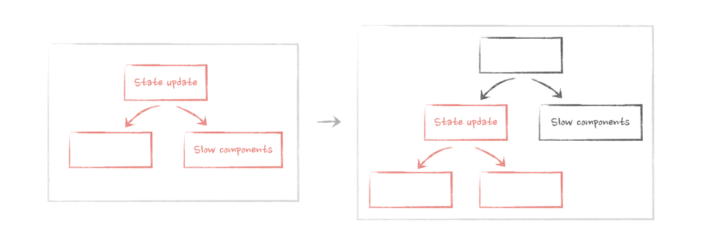
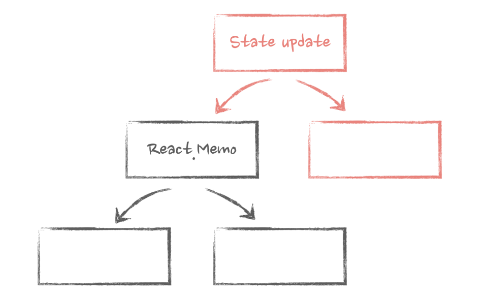
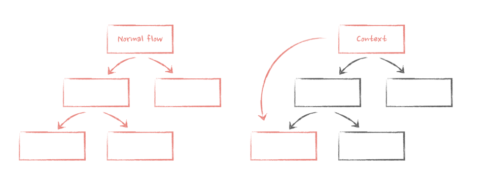
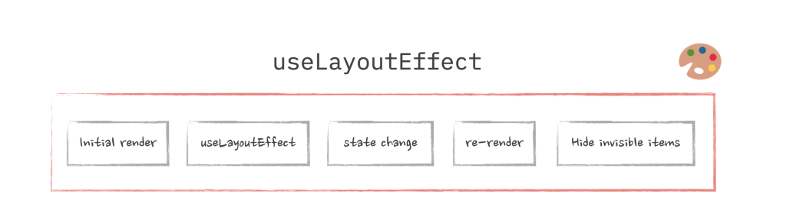

# [Advanced React](https://book.douban.com/subject/36631232/)

* [Developer Way](https://www.developerway.com/)
* [Advanced React](https://www.advanced-react.com/)
* [Author Youtube](https://www.youtube.com/@developerwaypatterns)

## Intro-to re-renders





* Re-rendering is how React updates components with new data. Without re-renders, there will be no interactivity in our apps.
* State update is the initial source of all re-renders.
* If a component's re-render is triggered, all nested components inside that component will be re-rendered.
* During the normal React re-renders cycle ( without the use of memoization ) , props change doesn't matter: components will re-render even if they don't have any props.
* We can use the pattern known as "moving state down" to prevent unnecessary re-renders in big apps.
* State update in a hook will trigger the re-render of a component that uses this hook, even if the state is not used.
* In the case of hooks using other hooks, any state update within that chain of hooks will trigger the re-render of a component that uses the very first hook.

## Elements, children as props, and re-renders (**Components as Props Pattern**)

Passing components as props can improve the performance.

```tsx
<Parent>
    <ExpensiveChild/>
</Parent>
```

当Parent组件因为自身状态变化rerender的时候，ExpensiveChild是作为props传进来的，因而不会被rerender( call ExpensiveChild function )。 在diff过程中，因为 ExpensiveChild 对应的 Element是 完全一致的，因而可以跳过diff过程。

* A component is just a function that accepts an argument (props) and returns Elements that should be rendered when this Component renders on the screen.
* An Element is an object that describes what needs to be rendered on the screen, with the type either a string for string for DOM element or a reference to a Component for components.
* Re-render is just React calling the Component's function.
* A component re-renders when its element object changes, as determined by ```Object.is``` comparison of it before and after re-render.
* When element are passed as props to a component, and this component triggers a re-render through a state update , elements that are passed as props won't re-render.

## Configuration concerns with elements as props

Components as Props Pattern 是 separation of concerns 的一种体现

### Conditional rendering and performance

```tsx
const App = ()=>{
    const [isOpen,setIsOpen] = useState(false);
    // Footer component will get involked after the isOpen is set to true
    const footer = <Footer />;

    return isOpen ? (
        <ModalDialog footer={footer} />
    ) : null;
}
```

If a component that has elements as props is rendered conditionally, then even if those elements are created outside of the condition, they will only be rendered when the conditional component is rendered.

### Default values for the elements from props

[Demo](https://www.advanced-react.com/examples/03/05)

```tsx
type ButtonProps = {
  icon: ReactElement;
  size?: 'large' | 'normal';
  appearance?: 'primary' | 'secondary';
};
const Button = ({ icon, size = 'normal', appearance = 'primary' }: ButtonProps) => {
  // create default props
  const defaultIconProps = {
    size: size === 'large' ? 'large' : 'medium',
    color: appearance === 'primary' ? 'white' : 'black',
  };
  const newProps = {
    ...defaultIconProps,
    // make sure that props that are coming from the icon override default if they exist
    ...icon.props,
  };

  // clone the icon and assign new props to it
  const clonedIcon = React.cloneElement(icon, newProps);

  return <button className={`button ${appearance}`}>Submit {clonedIcon}</button>;
};
```

基于cloneElement方法添加一些props。当然这个API现在已经不推荐使用了

## Advanced configuration with render props

* Render props were very useful when we needed to share stateful logic between components without lifting it up.
* But hooks replaced that use case in 99% of cases.
* Render props for sharing stateful logic and data can still be useful even today, for example, when this logic is attached to a DOM element.

```tsx
type ScrollDetectorProps = {
  children: (width: number) => ReactElement;
};

const ScrollDetector = ({ children }: ScrollDetectorProps) => {
  const [scroll, setScroll] = useState(0);
    // DOM related
  return (
    <div className="scrollable-block" onScroll={(e) => setScroll(e.currentTarget?.scrollTop)}>
      {children(scroll)}
      <br />
      <br />
      <br />
      <br />
      <br />
      <br />
      <br />
      <br />
      <br />
      <br />
      <br />
      <br />
      <br />
      <br />
    </div>
  );
};
```

## Memorization with useMemo useCallback and React.memo

* Memorizing props on a component makes sense only when:
  * This component is wrapped in React.memo
  * This component uses those props as dependencies in any of the hooks
  * This component passes those props down to other components and they have either of the situations from above
* If a component is wrapped in React.memo and its re-render is triggered by its parent, then React will not re-render this component if its props havn't changed. In any other case, re-render will proceed as usual.
* Memorizing all props on a component wrapped in React.memo is harder than it seems. Avoid passing non-primitive values that are coming from other props or hooks to it.
* When memorizing props, remember that "children" is also a non-primitive prop that need to be memorized.

```tsx
const Component1 = ()=>{
    const content = useMemo(()=> <div>children content</div>,[] );
    return <MemoChild>{content}</MemoChild>
}
const Component2 = ()=>{
    const contentfn = useCallback(()=><div>render props content</div>,[]);
    return <MemoChild>{contentfn}</MemoChild>
}
```

React.memo 过于脆弱，相关的 props (包括children)都要缓存起来才能避免不必要的re-render.

在以往的实践中， useMemo useCallback有滥用的倾向。在很少使用React.memo这个大前提下，这两个主要应该服务于 作为其他 hook的dep的一部分，这时候缓存才有意义，尤其是useCallback。useMemo还可以argue是为了缓存 expensive calculations ，然而前端的计算大部分算不上昂贵。

## Deep dive into diffing and reconciliation

* React will compare elements between re-renders with elements in the same place in the returned array on any level of hierarchy.
* If the type of the elements and its position in the array is the same, React will re-render that element. If the type changes at that position, then React will unmount the previous component and mount the new one.
* If the array is dynamic, then React can't reliably identify those elements between re-renders. So we use the key attribute to help it. This is important when the array can change the number of its item or their position between re-renders, and especially important if those elements are wrapped in React.memo
* We can use the key outside of dynamic arrays as well to force React to recognize elements at the same position in the array with the same type as different, or to force it to recognize elements at different positions with the same type as the same.
* We can also force unmounting of a component with a key if that key changes between re-renders based on some information. This is sometimes called "state reset".

## HOC in modern world

A higher-order component is just a function that accepts a component as an argument and returns a new component. That new component renders the component from the argument.

其实我觉得这一章作者举的例子有点牵强了

## React Context and Performance

通过这一章我发现我之前使用 Context 的方式是非常不 performant 的。

我之前的使用方式是这样的:

```tsx
const Component = ()=>{
    const [state,setState] = useState({name:"jiangshanmeta"});

    return (
        <Context.Provider value={{state,setState}}>
            <ChildComponent/>
        </Context.Provider>
    )
}
```

这种使用方式只解决了 Props drilling 问题，但是一旦调用 context 注入的 setState方法, trigger re-render, Component 组件会 re-render, 进而 ChildComponent 组件会 re-render。同时注意到 Provider 的 value 也会变化 (因为是一个新的对象), ChildComponent中使用这个Context的组件都会re-render，即使使用了 React.memo 进行了优化。

我们首先可以基于 **Components as Props Pattern** 进行优化：

```tsx
const ContextController = ({children})=>{
    const [state,setState] = useState({name:"jiangshanmeta"});

    return (
        <Context.Provider value={{state,setState}}>
            {children}
        </Context.Provider>
    );
}
```

ContextController 组件负责维护状态，通过 Component as Props Pattern 把需要从context中拿数据的组件注入进来。这样ContextController因为自身状态更新造成的re-render不会导致 children 变化，减少了一部分不必要的 re-render。但是children使用到这个context的组件都会强制re-render，进行数据更新。这样就会实现下图中的效果。



注意这里的 value 变化会有以下后果:

* Context consumers will re-render when the value on the Provider changes.
* All of them will re-render, even if they don't use the part of the value that actually changed.
* Those re-renders can't be prevented with memorization (easily).

如何减少第一条value change，最简单的就是使用useMemo/useCallback

```tsx
const ContextController = ({children})=>{
    const [state,setState] = useState({name:"jiangshanmeta"});
    const value = useMemo(()=>{
        return {
            state,
            setState
        }
    },[state,setState])

    return (
        <Context.Provider value={value}>
            {children}
        </Context.Provider>
    );
}
```

这样防止因为父组件 re-render 造成这里的 ContextController re-render，进而造成 Provider的value变化，进而导致大范围的re-render. ( 这里是默认使用 useMemo/useCallback 不会引起提早优化的例子 )

如何减少不关心的数据引起的变化呢，可以使用 **Split Provider** 这种模式：

```tsx
const ContextData = React.createContext({ isNavExpanded: false });

const ContextApi = React.createContext({ open: () => {}, close: () => {} });

const ContextController = ({ children }: { children: ReactNode }) => {
  const [isNavExpanded, setIsNavExpanded] = useState(false);

  const open = useCallback(() => setIsNavExpanded(true), []);

  const close = useCallback(() => setIsNavExpanded(false), []);

  const data = useMemo(() => ({ isNavExpanded }), [isNavExpanded]);

  const api = useMemo(() => ({ open, close }), [close, open]);

  return (
    <ContextData.Provider value={data}>
      <ContextApi.Provider value={api}>{children}</ContextApi.Provider>
    </ContextData.Provider>
  );
};
```

上面这个例子也可以看作 Command Query Responsibility Segregation ( CQRS ) 的一个体现。

再复杂一点的场景， command 需要基于当前的数据进行操作，虽然 setState可以传入callback，但是仅能获取其中的一个值。如果 command 依赖多个当前的state，可以考虑使用useReducer。

最后一个问题，Context会使得 React.memo 缓存失效，优化思路是要缓存的Component不要直接使用 useContext，通过父组件传递下来需要从context获取的值。这样可以尽可能保证只在需要的属性变化的时候re-render。

通用的实现可以使用HOC

```tsx
// HOC
const withNavigationOpen = (AnyComponent)=>{
    const Memo = React.memo(AnyComponent)

    return (props)=>{
        const {open} = useContext(Context);

        return <Memo  {...props} open={open} />
    }
}
```

## Refs: from storing data to imperative API

* A Ref is just a mutable object that can store any value. That value will be preserved between re-renders.
* A Ref's update doesn't trigger re-renders and is synchronous.
* We can assign a Ref to a DOM element via the ```ref``` attribute. After that element is rendered, we'll see that element in the ```ref.current``` property.
* We can pass Refs as a regular props to any component.
* If we want to pass it as the actual ref prop, we need to wrap that component in ```forwardRef```. Otherwise, it won't work in functional components. The second argument of that component will be the ref itself, which we then need to pass down to the desired DOM element.
* We can hide the implementation details of a component and expose its public API with the ```useImperativeHandle``` hook.

父组件传递ref下来，子组件再传递给DOM节点，本身是**leaking implementation detail**, 我们可以通过 ```useImperativeHandle``` 来暴露出外界需要的API，隐藏实现细节。当然，既然ref是一个可变的对象，我们也可以直接操作这个对象

```tsx
type Api = {
  focus: () => void;
  shake: () => void;
};

type InputFieldProps = {
  apiRef: MutableRefObject<Api>;
};

const InputField = ({ apiRef }: InputFieldProps) => {
  apiRef.current = {
    focus:()=>{},
    shake:()=>{}
  }

  return null;
}
```

这样也可以实现和useImperativeHandle同样的效果

## Closures in React

可以直接看ahooks的useMemoizedFn的实现

[useMemoizedFn](https://github.com/alibaba/hooks/blob/master/packages/hooks/src/useMemoizedFn/index.ts)

## Implementing advanced debouncing and throttling with Refs

```typescript
const useDebounce = (callback: () => void) => {
  const ref = useRef<any>();

  useEffect(() => {
    ref.current = callback;
  }, [callback]);

  const debouncedCallback = useMemo(() => {
    const func = () => {
      ref.current?.();
    };

    return debounce(func, 1000);
  }, []);

  return debouncedCallback;
};
```

参考 useMemoizedFn 的实现，也可以这么写：

```typescript
const useDebounce = <T extends (...args:any)=>any >(callback: T )=>{
  const fnRef = useRef<T>(callback);
  // // https://github.com/alibaba/hooks/issues/728
  fnRef.current = useMemo<T>(() => fn, [fn]);

  const debouncedFn = useRef<T>();

  if(!debouncedFn.current){
    debouncedFn.current = debounce((...args)=>fnRef.current(...args),1000)
  }
  return debouncedFn.current as T;
}
```

## Escaping Flickering UI with useLayoutEffect

* useEffect is normally run asynchronously. Asynchronous code is a separate task from the browser's perspective.
* useLayoutEffect hook is run synchronously. From the browser's perspective, it will be one large, unbreakable task. So the browser will wait and will not paint anything until the task is complete and the final dimensions are calculated.




useEffect is not guaranteed to run asynchronously. While react will try to optimize it as much as possible, there are cases when it can run before the browser paint and block it as a result. One of those cases is when you already have useLayoutEffect somewhere in the chain of updates.

The thing is, React runs re-renders in "snapshots" or cycles. Every re-render cycle will look something like this, in this order: "State update triggered ->  useLayoutEffect triggered ->  useEffect triggered ". If any of these triggers a state update, it will start another re-render cycle. But before doing that, React needs to finish the cycle that initiated the state update. So useEffect has to run before the new cycle starts. So if the state update is triggered inside useLayoutEffect, which is synchronous, React has no choice but to run useEffect synchronously as well.
