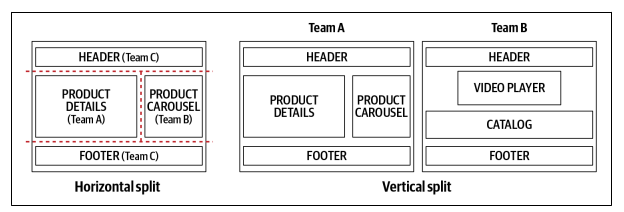

# [Building Micro-Frontends](https://book.douban.com/subject/34973908/)

## Microservice/Micro-Frontends Principles

* Modeled around business domains.
* Culture of Automation.
* Hide Implementation Details.
* Decentralize Goverance.
* Deploy Independently.
* Isolate Failure.
* Highly Observable.

## Define Micro-Frontends

With the horizontal split, multiple MFEs will be on the same view. Multiple teams will be responsible for parts of the view and will need to coordinate their efforts. This approach provides greater flexibility considering we can reuse some MFEs in different views, although it also requires more discipline and goverance for not ending up with hundreds of MFEs in the same project.

In the vertical split senario, each team is responsible for a business domain. In this case, DDD comes to rescue.

Horizontal split better serves static pages like catalogs or ecommerce instead of a more interactive project that would require a vertical split.
