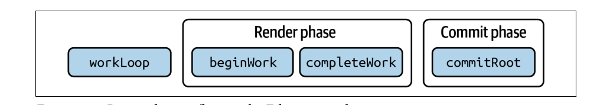

# [Fluent React](https://book.douban.com/subject/36677814/)

## JSX

Benefits of JSX:

* Easier to read and write
* Improved security
* Strong typing
* Encourages component-based architecture
* Widely used

Drawbacks of JSX:

* Learning curve
* Requires tooling
* Mixing of concerns
* Partial JavaScript compatibility

## The Virtual DOM

Diff Algorithm:

* If the nodes at the root level of the two trees are different, React will replace the entire tree with the new one.
* If the nodes at the root level are the same, React will update the attributes of the node if they have changed.
* If the children of a node are different, React will update only the children that have changed. React does not re-create the entire subtree; it only updates the nodes that have changed.
* If the children of a node are the same, but their order has changed, React will reorder the nodes in the read DOM without re-creating them.
* If a node is removed from the tree, React will remove it from the real DOM.
* If a new node has been added to the tree, React will add it to the real DOM.
* If a node's type has changed, React will remove the old node and create a new node of the new type.
* If the node has a key prop, React use it to know if it should replace the node or not. It can be useful when you need to reset the state of the components (force mount).

## Inside Reconciliation

[React Reconciliation](https://www.geeksforgeeks.org/reactjs-reconciliation/)

Fiber reconciliation happens in two phases: the render phase and the commit phase. This two-phase approach allows React to do rendering work that can be disposed of at any time before committing it to the DOM and showing a new state to users: it makes rendering interuptible.



## Common Questions and Powerful Patterns

这一章介绍了React提供的几个优化API和Patterns

### React.memo

这个是对组件的包装，目的是props不变就不要rerender (当然自身state的变化和context也会引起rerender)

使用的时候要在父组件中结合使用useMemo和useCallback，减少不必要的props变化，进而减少无效的rerender。

### useMemo useCallback

useMemo是对数据的缓存，要注意不要overuse。

对于useCallback我更倾向于使用 [useMemoizedFn](https://ahooks.js.org/zh-CN/hooks/use-memoized-fn)替代，无需关心deps参数，并且能保证返回的函数地址不变。

### React.lazy 和 React.Suspense

结合使用，异步加载组件。Suspense可以提供一个fallback指示loading，优化用户体验。

### Presentational/Container Component

Presentational Component renders the UI, and the Container Component handles the state of the UI.

还有一个类似个概念叫 headless component，就是之负责逻辑，然后通过 render props 和具体的UI组件结合起来。

当然现在都是用hook啦，hook负责state。

### High-Order Component

在Class Component时代这个很流行，现在主要是用hook了。

### Render Props

现在用的也不多了，都被hook替代了

### Control Props Pattern

这个是基于 controlled component 的扩展。

Controlled component 自身不维护状态， 通过props接收当前的状态 (single source of truth for state)，通过调用callback通知父组件状态的改变。

Control Props 允许 通过props控制状态(传统的 controlled component) 或者 内部维护状态 (没有props时fallback到这种模式)。

This pattern enhance component flexibility, offering both controlled and uncontrolled modes of operation. It allows the parent to be in charge when necessary, while also letting the component retain autonomy over its own state when not explicitly controlled.

### Prop Collections

[Reference](https://medium.com/@elhamelshami.dev/what-is-the-prop-getters-pattern-26349e5637df)

```javascript

import { useCallback, useMemo, useState } from "react";
const executeFunctions = (...funs) => (...args) =>
  funs.forEach((fun) => fun && fun(...args));
export default function useToggle() {
  const [isToggle, setStateToggle] = useState(false);
  const toggle = useCallback(
    () => setStateToggle((prevValue) => !prevValue),
    []
  );
  const getTogglerProps = useCallback(
    ({ onClick, props }) => ({
      is_on: `${isToggle}`,
      onClick: executeFunctions(onClick, toggle),
      ...props
    }),
    [toggle, isToggle]
  );

  const values = useMemo(() => ({ isToggle, toggle, getTogglerProps }), [
    isToggle,
    toggle,
    getTogglerProps
  ]);
  return values;
}
```

大体上是hook返回一个函数，函数返回的是component的props。之所以返回是函数是为了提高灵活性，能够增强返回的props。

### Compound Component Pattern

对于 Menu/MenuItem Accordion/AccordionItem Select/Option RadioGroup/Radio 这种类型的组件，一种设计是不暴露这些Item组件，只暴露Group组件并提供一个items属性，Group组件基于这个items属性渲染Item组件，这样实现对于使用者来说使用简单，只需要传递数据即可，针对简单场景使用方便，但是不够灵活。

Compound Component Pattern 把Group和Item类型组件都暴露出来，这样 invert control of rendering , separation of concerns 更加 flexible . 这一模式下 Group和Item组件数据通讯需要利用Context辅助了。

其实两种模式可以都兼容，如果传了items数组按照按照第一种模式处理，基于数组渲染Item，如果没有items数组按照compound component pattern处理，渲染children。
