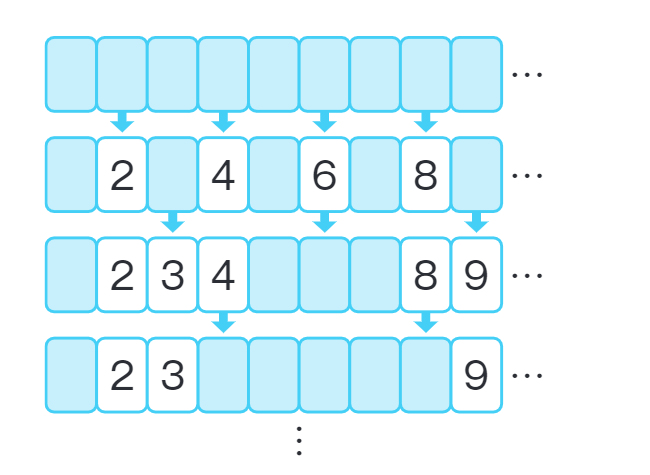

# 翻牌

> 有1-N共N张牌，升序排列。最开始背面朝上。某人从第二张牌开始，每隔1张牌翻牌( 即2的倍数都翻牌 )。下一个人从第三张牌开始，每隔两张牌进行翻牌 ( 即3的倍数进行翻牌 ) 。这样N-1轮过后，背面朝上的数字有哪些。



这个问题和LeetCode的[灯泡开关](https://leetcode.cn/problems/bulb-switcher/)是同样的一个问题。

很容易想到进行模拟操作，暴力计算。

```typescript
function flipCard(N: number) {
  const cards = new Array<boolean>(N + 1).fill(false)
  for (let i = 2; i <= N; i++) {
    for (let j = i; j < cards.length; j += i)
      cards[j] = !cards[j]
  }
  const result: number[] = []
  for (let i = 1; i < cards.length; i++) {
    if (!cards[i])
      result.push(i)
  }
  return result
}
```

进一步分析可以知道，对于数字i，若 ```i === a*b```且```a !== b```， 则从a开始翻牌和从b开始翻牌的效果是抵消的。要使得牌i最终是反转的，即意味着i的除1以外的因数为偶数个，即数字i包含1的因数的个数为奇数个，即数字i为平方数。

```typescript
function flipCard(N: number) {
  const result: number[] = []
  let i = 1
  while (i * i <= N) {
    result.push(i * i)
    i++
  }
  return result
}
```

这个实现时间复杂度为O(√N)
