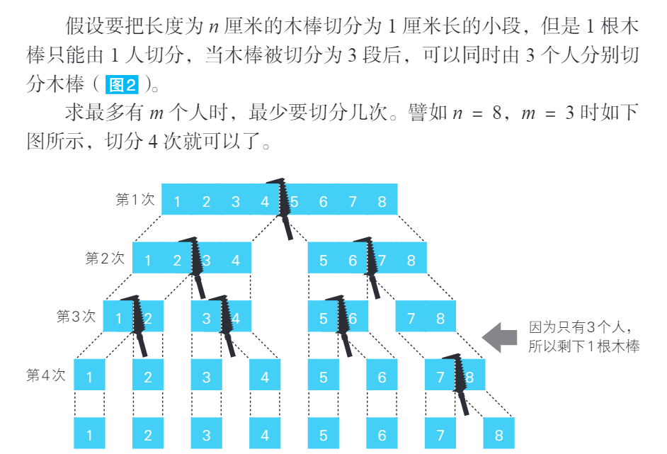

# 切分木棒



思路是贪心。长度为N，即需要切分N-1次，每次切分应处理长度较长的木棒，并且切分要尽可能均分，这样可以让更多的人参与下一轮切分。

```typescript
function cutbar(n: number, m: number) {
  n--
  let count = 0
  while (n > 0) {
    // m个人可以都开始切分了
    if (count + 1 === m) {
      count += Math.ceil(n / m)
      n = 0
    }
    else {
      count++
      // 每轮只能切分 count次
      n -= count
    }
  }
  return count
}
```
