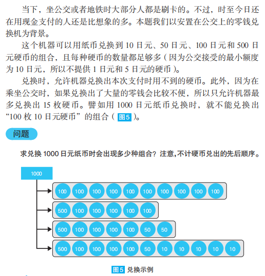

# 还在用现金支付吗



作者的思路是枚举每个硬币出现的次数，暴力计算：

```typescript
function coinChange() {
  const counts500 = range(0, 2)
  const counts100 = range(0, 10)
  const counts50 = range(0, 15)
  const counts10 = range(0, 15)
  let result = 0
  for (const count500 of counts500) {
    for (const count100 of counts100) {
      for (const count50 of counts50) {
        for (const count10 of counts10) {
          if (count500 + count100 + count50 + count10 <= 15 && count500 * 500 + count100 * 100 + count50 * 50 + count10 * 10 === 1000)
            result++
        }
      }
    }
  }
  return result
}

function range(start: number, end: number, step = 1) {
  const result: number[] = []
  for (let i = start; i <= end; i += step)
    result.push(i)

  return result
}
```

但是事情没那么简单，我们可以看到[LeetCode](https://leetcode.cn/problems/coin-change-ii/)上一道非常相似的问题。书中的题目其实比LeetCode的题目还难一点，因为限制了最大的coin数量。

我们按照动态规划的思路实现如下：

```typescript
function coinChange() {
  // 为了节约时间和空间，这里硬币都除了他们的最大公约数10
  // dp[i][j] coin价值总和为i coin数量为j 这种情况下的总的方案数
  const dp = new Array<number[]>(101)
  for (let i = 0; i < dp.length; i++)
    dp[i] = new Array<number>(16).fill(0)

  dp[0][0] = 1
  const coins = [1, 5, 10, 50]
  for (const coin of coins) {
    for (let i = coin; i < dp.length; i++) {
      for (let j = 1; j < 16; j++)
        dp[i][j] += dp[i - coin][j - 1]
    }
  }

  return dp[dp.length - 1].reduce((sum, item) => sum + item, 0)
}
```

在进一步，书中给出的coin总价值、coin数量、coin面值都是硬编码的，我们可以进一步推广：

```typescript
function coinChange(value: number, count: number, originCoins: number[]) {
  const coinGCD = gcdList([...originCoins, value])
  const coins = originCoins.map(item => item / coinGCD)
  value /= coinGCD
  const dp = new Array<number[]>(value + 1)
  for (let i = 0; i < dp.length; i++)
    dp[i] = new Array<number>(count + 1).fill(0)

  dp[0][0] = 1

  for (const coin of coins) {
    for (let i = coin; i < dp.length; i++) {
      for (let j = 1; j < count + 1; j++)
        dp[i][j] += dp[i - coin][j - 1]
    }
  }

  return dp[dp.length - 1].reduce((sum, item) => sum + item, 0)
}

function gcdList(nums: number[]) {
  let result = nums[0]
  for (let i = 1; i < nums.length; i++) {
    result = gcd(result, nums[i])
    if (result === 1)
      break
  }
  return result
}

function gcd(a: number, b: number) {
  if (a < b) {
    const tmp = a
    a = b
    b = tmp
  }
  while (b !== 0) {
    const tmp = a % b
    a = b
    b = tmp
  }
  return a
}
```
