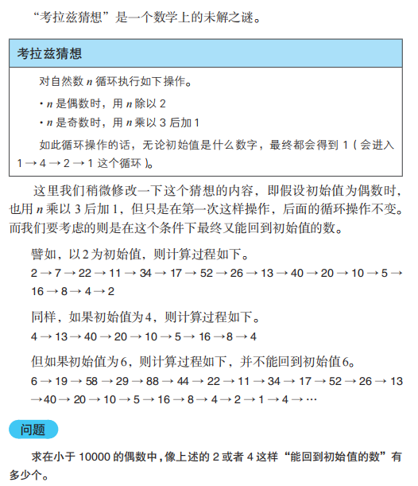

# 改版考拉兹猜想



```typescript
function isLoop(n: number) {
  let check = 3 * n + 1
  while (check !== 1) {
    if (check & 1)
      check = check * 3 + 1

    else
      check >>= 1

    if (check === n)
      return true
  }
  return false
}

function collatz() {
  let result = 0
  for (let i = 2; i < 10000; i++) {
    if (isLoop(i))
      result++
  }
  return result
}
```
