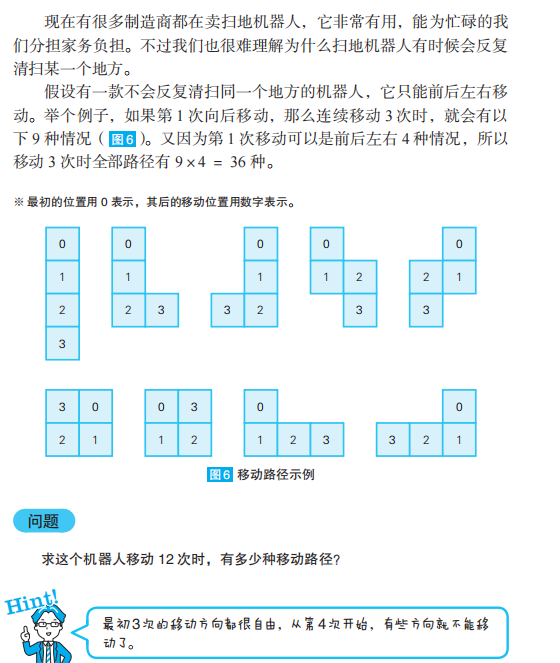

# 优秀的扫地机器人



```typescript
const N = 12
const deltas = [
  [0, 1],
  [0, -1],
  [-1, 0],
  [1, 0],
]
function move(log: string[]) {
  if (log.length === N + 1)
    return 1

  let count = 0
  const last = log[log.length - 1].split(',')
  const x = +last[0]
  const y = +last[1]
  deltas.forEach(([dx, dy]) => {
    const nexPos = `${x + dx},${y + dy}`
    if (!log.includes(nexPos))
      count += move([...log, nexPos])
  })

  return count
}
```

作者的思路是DFS暴力搜索，我也没想到更好的思路，但是总感觉是个数学问题。
