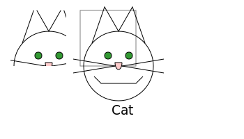
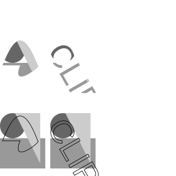

# 裁剪和蒙版

## 裁剪路径

可以使用```<clipPath>```建立自己的裁剪区域。

创建一个矩形裁剪：

```html
<defs>
    <clipPath id="rectClip">
        <rect
            id="rect1"
            x="15"
            y="15"
            width="80"
            height="80"
            style="stroke:gray;fill:none;"
        />
    </clipPath>
</defs>

<use
    xlink:href="#cat"
    style="clip-path:url(#rectClip)"
/>
```



clipPath元素支持基本形状,```<path>```元素 或者```<text>```元素作为子元素。



## 蒙版

相当于指定某块区域的透明度

```html
<mask 
    id="opacityMask" 
    x="0" 
    y="0" 
    width="1" 
    height="1"
    maskContentUnits="objectBoundingBox"
>
    <rect x="0" y="0" width="1" height="1" style="fill-opacity: 0.75; fill: white;"/>
</mask>
```


