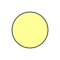

# SVG动画

## 动画基础

```html
<rect
    x="10"
    y="10"
    width="200"
    height="20"
    stroke="black"
    fill="none"
>
    <animate
        attributeName="width"
        attributeType="XML"
        from="200"
        to="20"
        begin="0s"
        dur="5s"
        fill="freeze"
    />
</rect>
```


对```<rect>```元素添加动画，其中```<animate>```元素指定了以下元素：

* attributeName 动画中应该持续改变的值，这里是width
* attributeType width属性是一个XML属性，应一个常用的值是CSS，表示要改变的是CSS属性。默认是auto，会先尝试CSS属性，然后才是XML属性
* 属性的起始(from)和结束(to)值。from可选，默认采用父元素的值
* 动画开始时间(begin)和持续时间(dur)
* 动画结束后做什么(fill) ， 例子中freeze意味着冻结为to值。默认值```remove```,动画结束后会返回原始值

可以多个动画结合：



```html
<rect
    x="10"
    y="10"
    width="20"
    height="20"
    style="stroke:black;fill:green;fill-opacity:0.25"
>
    <animate
        attributeName="width"
        attributeType="XML"
        from="20"
        to="200"
        begin="0s"
        dur="8s"
        fill="freeze"
    />
    <animate
        attributeName="height"
        attributeType="XML"
        from="20"
        to="150"
        begin="0s"
        dur="8s"
        fill="freeze"
    />
    <animate
        attributeName="fill-opacity"
        attributeType="CSS"
        from="0.25"
        to="1"
        begin="0s"
        dur="3s"
        fill="freeze"
    />
    <animate
        attributeName="fill-opacity"
        attributeType="CSS"
        from="1"
        to="0.25"
        begin="3s"
        dur="3s"
        fill="freeze"
    />
</rect>
```

## 同步动画

可以绑定动画的开始时间是另一个动画的开始或者结束

```html
<circle
    cx="60"
    cy="60"
    r="30"
    style="fill:#f9f;stroke:gray;"
>
    <animate
        id="c1"
        attributeName="r"
        attributeType="XML"
        begin="0s"
        dur="4s"
        from="30"
        to="10"
        fill="freeze"
    />
</circle>

<circle
    cx="120"
    cy="60"
    r="10"
    style="fill:#9f9;stroke:gray"
>
    <animate
        attributeName="r"
        attributeType="XML"
        begin="c1.end" // c1动画的结束时间为开始时间
        dur="4s"
        from="10"
        to="30"
        fill="freeze"
    />
</circle>
```



还可以设置一个偏移量，比如```begin="c1.end+2s"```

### end 属性

可以使用end属性来控制动画的结束时间，当end属性和dur属性同时存在时，动画的结束时间决定于谁先到达。

end属性类似于begin属性，可以依赖于其他动画的开始或结束时间，例如：```end="c1.end"```。

## 重复动作

想要重复动画，有两个属性：

* repeatCount 重复动画的次数
* repeatDur 重复动画的时间

如果想要无尽的动画，可以指定为 indefinite


## 对复杂的属性应用动画

对路径或者多边形应用动画


```html
<path
    d="M 15 50 Q 40 15 50 50 65 32 100 40"
    style="fill:none;stroke:black;"
    transform="translate(0,50)"
>
    <animate
        attributeName="d"
        attributeType="XML"
        to="M 50 15 Q 15 40 50 50 32 65 40 100"
        begin="0s"
        dur="5s"
        fill="freeze"
    />
</path>
```

## 指定多个值

from和to元素只能提供开始和结束两个值，通过values属性可以提供一系列值

```html
<circle
    cx="50"
    cy="50"
    r="30"
    style="fill:#ff9;stroke:black;"
>
    <animate
        attributeName="fill"
        begin="2s"
        dur="4s"
        values="#ff9;#99f;#f99;#9f9;"
    />
</circle>
```



通过将values设为 start;end;start的形式，可以实现交替来回的动画。

## 多级动画时间

当使用values指定多个值时，默认情况下持续时间会均等划分到每个过渡。可以使用keyTimes属性划分持续时间。

keyTimes必须要和values的条目数目相同，第一个条目始终为0，最后一个始终为1，中间时间使用0到1之间的小数表示。

## ```<set>```元素

对于不能过渡的属性，希望在某个时间点上改变某个值，可以使用```<set>```元素。

```html
<text
    text-anchor="middle"
    x="60"
    y="60"
    style="visibility:hidden;"
>
    <set
        attributeName="visibility"
        attributeType="CSS"
        to="visible"
        begin="3s"
        dur="1s"
        fill="freeze"
    />
    All gone
</text>
```


## ```<animateTransform>```元素

animate元素并不适用于旋转、平移、缩放、倾斜变换，因为它们被包裹在transform属性内，可以使用```<animateTransform>```元素解决。

```html
<rect
    x="-10"
    y="-10"
    width="20"
    height="20"
    style="fill:#ff9;stroke:black;"
>
    <animateTransform
        attributeType="XML"
        attributeName="transform"
        type="scale"
        from="1"
        to="4 2"
        begin="0s"
        dur="4s"
        fill="freeze"
    />
</rect>
```


