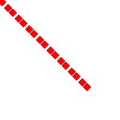
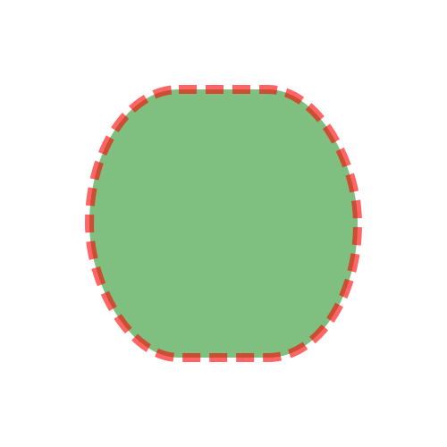
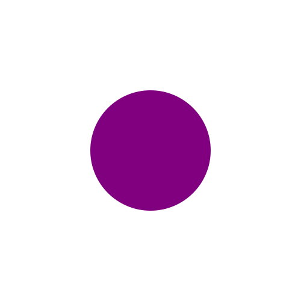
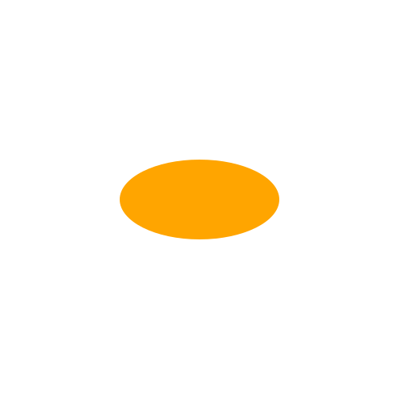
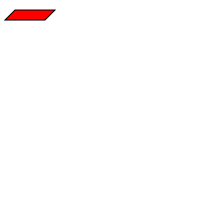
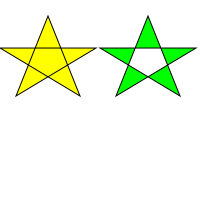
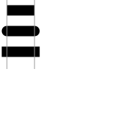

# 基本形状

## 线段

SVG中可以使用```<line>```元素画出一条直线段。需要指出起止点的x和y坐标。

```html
<line x1="0" y1="0" x2="100" y2="100" style="stroke:black;" />
```


## 画笔特性

### stroke-with 画笔宽度

### stroke 画笔颜色

可以使用以下颜色：

* 颜色关键字，如 red
* 6位16进制数字，如 #ff0000
* 3位16进制数字，如 #f00
* rgb颜色
* currentColor关键字，表示当前元素应用的CSS属性color的值

如果不指定画笔颜色，将看不到任何线，因为stroke属性的默认值是none

### stroke-opacity 画笔透明度

取值范围 0.0～1.0

### stroke-dasharray

可以用来制作虚线。该属性的值由一组用逗号分割的数字构成，表示线的长度和空隙的长度。

数字的个数应为偶数，如果指定的数字个数为奇数，SVG会重复一次，使得总数为偶数。

```html
<!-- 10像素线 4像素空隙 10像素线 1像素空隙 如此反复 -->
<line x1="0" y1="0" x2="150" y2="150" style="stroke:red; stroke-width:10;stroke-dasharray: 10, 4, 10, 1"  /> 
```



## 矩形

使用```<rect>```绘制矩形，需要指定矩形左上角的x和y坐标，以及宽度width和高度height。

举行内部可以使用fill属性指定填充的颜色，默认是黑色，可以设为```none```不填充。

fill-opacity指定填充透明度。

矩形依然可以通过stroke、stroke-width、stroke-opacity绘制边框。构成边框的画笔是“骑”在网格线上的，所以一半在矩形内，一半在矩形外。

可以通过指定rx、ry属性指定矩形的圆角。如果只指定了其中的一个，缺失的和指定的相等。这两个属性可以指定百分比，但是是相对视口的宽高计算的，所以不太常用。



## 圆和椭圆

绘制圆需要使用```<circle>```元素，并指定圆心的x和y坐标(cx/cy)以及半径(r)



绘制椭圆需要使用```<ellipse>```元素，指定圆心的x和y坐标(cx/xy)以及x方向和y方向的半径(rx/ry)



## 多边形

使用```<polygon>```绘制任意封闭图形。使用points属性指定一系列关键点的坐标

```html
<polygon
    points="15,10 55,10 45,20 5,20"
    fill="red"
    stroke="black"
/>
```



当多边形的边有交叉时，区分图形内部和外部就变得困难了。fill-rule属性可以用来控制，它有两个值：nonzero(默认值)和evenodd。



## 折线

使用```<polyline>```元素绘制折线，```<polyline>```和```<polygon>```非常类似，```<polygon>```会把最后一个点和第一个点连接起来。


## 线帽和线连接

当使用```<line>```或者```<polyline>```画线时，可以使用```stroke-linecap```指定线的头尾形状。

stroke-linecap有以下属性值：

* butt 默认值 头尾平的
* round 头尾为圆的
* square 矩形



可以使用```stroke-linejoin```属性指定线段在棱角处交叉时的效果，该属性有以下可选值：

* miter 尖的
* round 圆的
* bevel 平的


