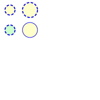
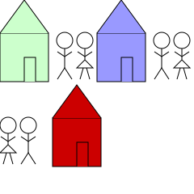

# 文档结构

## 在SVG中使用样式

### 内联样式

设置style属性为一系列视觉属性，这是首选的方式

```html
<circle cx="20"  cy="20" r="10" style="stroke:black; stroke-width:1.5;fill:blue;fill-opacity:0.6;" />
```

### 内部样式表

```html
<defs>
    <style type="text/css"><![CDATA[
        circle {
            fill:#ffc;
            stroke:blue;
            stroke-width:2;
            stroke-dasharray: 5 3;
        }
    ]]>]</style>
</defs>
```



### 外部样式表

```html
<?xml-stylesheet href="ext_style.css" type="text/css"  ?>
```

### 表现属性

```html
<circle  cx="10" cy="10" r="5" fill="red" stroke="black" stroke-width="2" />
```

表现属性的优先级最低，任何内联样式 样式表的样式声明都会覆盖表现属性。

表现属性会覆盖继承的样式。

## 分组和引用对象

### ```<g>```元素

通过使用```<g>```元素，将其所有子元素作为一个组合，通常组合还有一个唯一的id作为名称。

每个组合还可拥有自己的```<title>```和```<desc>```元素，提供基本描述。


### ```<use>```元素

定义了一组图形对象后，可以使用```<use>```标签再次显示他们，使用```xlink:href```属性指定URI即可，听时还要指定x和y的位置，表示组合的原点应该移动到的位置。


### ```<defs>```元素

将所有想要复用的元素放在```<defs>```元素中，```<defs>```中的元素只定义但是不显示。



另外```<use>```元素使用元素，并不限制在同一文件内定义的对象。

```html
<use xlink:href="otherfile.svg#logo"/>
```

### ```<symbol>```元素

该元素类似于```<g>```元素，但是不会显示。处于习惯，依然会把它放在```<defs>```元素内部。

### ```<image>```元素

使用```<image>```元素可以包含一个完整的SVG或者位图文件。

```html
<image xlink:href="file.jpg" x="100" height="100" />
```
