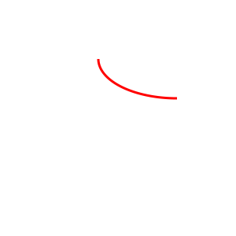

# 路径

我们接触过的```<line>```、```<rect>```等都是```<path>```元素的简写形式，使得SVG更可读、更加结构化。

描述轮廓的数据都放在```<path>```元素的d属性中。路径数据包括单个字符的命令，比如M表示moveto，L表示lineto，接着是该命令的坐标信息。

## moveto、lineto和closepath

每个路径都必须以moveto名嗯令开始(命令字母为**M**)，紧跟着一个使用逗号或者空格分割的x和y坐标。

moveto后面跟着一个或者多个lineto命令(命令字母为**L**)，他的后面也是由逗号或者空格分割的x和y坐标(可以多组)。

```html
<path d="M 10 10 L 100 10" />
<path d="M 10 20 L 100 20 L 100 50" />
<path d="M 40 60 L 10 60 L 40 42.68 M 60 60 L 90 60 L 60 42.68 " />
<path d="M 30 30 L 55 5 80 20 55 55 Z">
```


想绘制封闭图形，可以使用closepath(命令字母为**Z**)，绘制一条回到当前子路径起点的线。

```html
<path
    d="M 40 60 L 10 60 L 40 42.68 Z  M 60 60 L 90 60 L 60 42.68 Z"
    style="fill:none;stroke:black;"
/>
```


## 相对moveto和相对lineto

M和L命令的坐标都是绝对坐标，使用小写版本**m**和**l**会解析为相对坐标。

```html
<path 
    d="M 10 10 l 10 0 l 0 20 m 20 10 l 15 -5"
    style="stroke:black;"
/>
```

## 路径的快捷方式

| 简写形式 |       等价冗长形式       | 效果 |
| :--:    | :-------------------:  | :---:          |
| H x     | L x current_y | 绘制一条到绝对位置 (x,current_y)的线 |
| h x     | l x 0         | 绘制一条到 (current_x + x, current_y)的线 |
| V y     | L current_x y | 绘制一条到绝对位置(current_x,y)的线 |
| v y     | l 0 y         | 绘制一条到 (current_x, current_y+y)的线 |

## 椭圆弧

圆弧命令以字母A(绝对坐标的缩写)或者a(相对坐标的缩写)开始，后面紧跟以下7个参数：

* 点所在椭圆的x半径和y半径
* 椭圆的x轴旋转角度 x-axis-rotation
* large-arc-flag ,如果需要圆弧的角度小于180度，其为0；如果需要圆弧的角度大于等于180度，则为1。
* sweep-flag 如果需要顺时针绘制，则为1，如果需要逆时针绘制，则为0
* 终点的x坐标和y坐标



## 贝塞尔曲线

### 二次贝塞尔曲线

绘制二次贝塞尔曲线，需要指定起点、终点和控制点。

使用Q或者q指定一个二次曲线，后面紧跟着控制点和终点的坐标 (起点是上个命令的终点)。


还可以在二次曲线命令之后指定多组坐标，会生成多边贝塞尔曲线。

```html
<path
    d="M 30 100 Q 80 30 100 100 130 65 200 80"
    style="stroke:black; fill:none;"
/>
```


这样上一条二次贝塞尔曲线的终点作为下一条贝塞尔曲线的起点，连接处可能非常生硬。使用T命令，也可以绘制多边贝塞尔曲线，但是下一条贝塞尔曲线的控制点，与上一条贝塞尔曲线的控制点，关于上一条贝塞尔曲线的终点中心对称。

```html
<path
    d="M 30 100 Q 80 30 100 100 T 200 80"
    style="stroke:black; fill:none;"
/>
```


### 三次贝塞尔曲线

三次贝塞尔曲线有两个控制点，使用C命令(相对位置使用c)，后面跟着 两组控制点坐标和终点坐标，也可以跟着多组坐标，构建多边贝塞尔曲线。

```html
<path
    d="M 30 100 C 50 50 70 20 100 100   110 130 45 150 65 100"
    style="stroke:black; fill:none;"
/>
```


类似于二次贝塞尔曲线的多边场景，也会出现连接处生硬问题。可以使用S命令，新曲线的第一个控制点和上一条曲线的第二个控制点关于上一条曲线的终点中心对称。

```html
<path
    d="M 30 100 C 50 30 70 50 100 100 S 150 40 200 80"
    style="stroke:black; fill:none;"
/>
```


## ```<marker>```元素

```html
<defs>
    <marker 
        id="mCircle"
        markerWidth="10"  // marker拥有自己私有的坐标，因此需要指定markerWidth markerHeight
        markerHeight="10" 
        refX="5" // refX和refY指定 marker的哪个坐标 和路径的开始对其
        refY="5"
    >
        <circle cx="5" cy="5" r="4" style="fill:none;stroke:black;" />
    </marker>
</defs>
```


如果想要路径的起点、中间和终点都使用相同的标记，无需指定marker-start、marker-mid、marker-end属性，只需marker属性。
