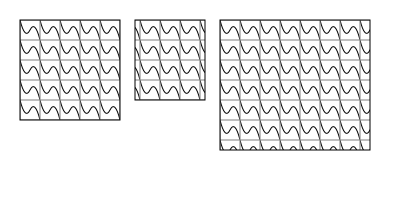
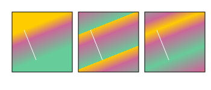
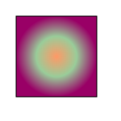

# 图案和渐变

## 图案

要创建图案，必须使用```<pattern>```元素包裹描述图案的```<path>```元素。

### patternUnits

patternUnits属性会决定如何排列。

如果希望每个图案填充对象的一定百分比，需要patternUnits设定为objectBoundingBox，指定图案左上角的x和y坐标，以及width和height (百分比或者0-1之间的小数)

```html
<pattern id="tile" x="0" y="0" width="20%" height="20%" patternUnits="objectBoundingBox">
    <path
        d="M 0 0 Q 5 20 10 10 T 20 20"
        style="stroke:black;fill:none;"
    />
    <path
        d="M 0 0 h 20 v 20 h -20 z"
        style="stroke:gray;fill:none;"
    />
</pattern>
```


如果希望按照固定尺寸进行重复，需要设置patternUnits属性值为 ```userSpaceOnUse```。

```html
<pattern id="tile" x="0" y="0" width="20" height="20" patternUnits="userSpaceOnUse">
    <path
        d="M 0 0 Q 5 20 10 10 T 20 20"
        style="stroke:black;fill:none;"
    />
    <path
        d="M 0 0 h 20 v 20 h -20 z"
        style="stroke:gray;fill:none;"
    />
</pattern>
```



### patternContentUnits

patternContentUnits用来规定用什么单位表达图案数据本身。默认为```userSpaceOnUse```,采用用户当前坐标系统。如果希望根据被填充的对象确定(按比例计算)，设为 ```objectBoundingBox```。

```html
<pattern 
    id="tile" 
    patternUnits="objectBoundingBox" 
    patternContentUnits="objectBoundingBox"
    x="0"
    y="0"
    width="0.2"
    height="0.2"
>
    // 注意要设置stroke-width
    <path
        d="M 0 0 Q 0.05 0.20 0.10 0.10 T 0.20 0.20"
        style="stroke:black;fill:none;stroke-width:0.01"
    />
    <path
        d="M 0 0 h 0.20 v 0.20 h -0.20 z"
        style="stroke:gray;fill:none;stroke-width:0.01"
    />
</pattern>
```


### 图案嵌套


## 渐变

### linearGradient元素

```html
<linearGradient
    id="two_hues"
>
    <stop offset="0%" style="stop-color:#906;stop-opacity:1.0;" />
    <stop offset="50%" style="stop-color:#906;stop-opacity:0.3;" />
    <stop offset="100%" style="stop-color:#0099cc;stop-opacity:0.1" />
</linearGradient>
```

stop元素有两个必须属性: offset和stop-color。offset用于确定线上哪个点的颜色应该等于stop-color。

还用```stop-opacity```属性指定透明度。


渐变的方向默认是沿着水平线从左到右。可以使用x1、y1、x2、y2指定渐变的起点和终点。


过渡不一定要从对象的一角到另一角，比如从 (20%,30%)到(40%,80%)过渡，剩余的空间该如何处理？ spreadMethod属性可以配置。有以下三个值：

* pad 起始和结束渐变点会扩展到对象的边缘
* repeat 渐变会重复起点到终点的过程，直到填充满整个对象
* reflect 渐变会按照终点到起点、起点到终点的排列重复



### radialGradient

```html
<radialGradient
    id="three_stops"
>
    <stop
        offset="0%"
        style="stop-color:#f96;"
    />
    <stop
        offset="50%"
        style="stop-color:#9c9;"
    />
    <stop
        offset="100%"
        style="stop-color:#906;"
    />
</radialGradient>
```



径向渐变的范围由cx(中心点x坐标)、cy(中心点y坐标)以及r(半径)决定，默认都是50%。
