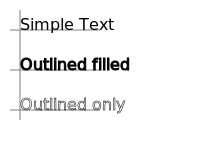
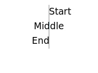
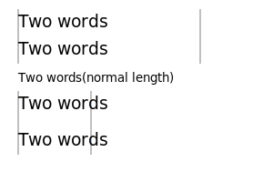
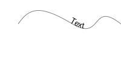

# 文本

## 文本的相关术语

* 字符。在XML文档中，字符是指带有一个数字值的一个或多个字节，数字值与Unicode标准对应。例如，字母g是Unicode值为103的字符
* 符号( glyph )是指字符的视觉呈现，每个字符都可以用很多不同的符号来呈现。一个符号可能由多个字符构成。
* 字体。字体是指代表某个字符集合的一组符号。字体中所有符号以基线对齐。基线到字体中最高字符顶部的距离称为上坡度，基线到最深字符底部的距离称为下坡度。字符的总高度为上坡度和下坡度之和，也称为em高度。

## ```<text>```元素的基本属性

使用```<text>```元素最简单的情况是值给定x和y属性，用来指定元素内容的第一个字符的基线位置。



以下CSS属性也可以应用到```<text>```元素上：

* font-family
* font-size
* font-weight
* font-style
* text-decoration
* word-spacing
* letter-spacing

## 文本对齐

text-anchor属性指定文本坐标生效的位置，它的可选值可以是start、middle、end。



## ```<tspan>```元素

类似于HTML中的```<span>```元素，```<tspan>```元素用来嵌套在文本内容中，并且可以改变文本样式。


在```tspan```元素上可以应用```baseline-shift```属性实现上标(属性值为 super )和下标(属性值为 sub)效果。


## 设置文本长度

可以设置文本长度，SVG会将文本调整到指定长度。调整的时候，可以只调整字符的间距，保持字符本身大小不变( lengthAdjust 属性设为 spacing ，也是默认值 )，也可以同时调整字符间距和字符大小( lengthAdjust 属性设为 spacingAndGlyphs )。



## 纵向文本


## 文本路径

文本可以沿着任何抽象的路径排列

```html
<text>
    <textPath xlink:href="#curvepath" startOffset="50%" >
        Text
    </textPath>
</text>
```

设置startOffset调整文本在路径上开始的位置。


