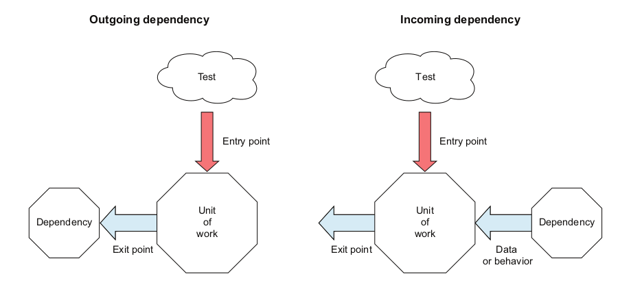

# [The Art of Unit Testing](https://book.douban.com/subject/34944396/)

## The basics of unit testing

Three types of exist points:

* return value。 这种最好做测试，只需要对返回值做断言
* state change。 比如一个class内部状态变化，可以调用getter方法观测到，也比较好测试
* call third-party dependency。 这种需要破除依赖才能测试。

关于dependency, 作者是这么定义的：

> A dependency is something we don't have full control over during a unit test. Or it can be something that trying to control in a test world make our lives miserable.

和[Unit Testing](https://book.douban.com/subject/34429421/)的定义比较，shared/out-of-process dependency 属于我们不能完全控制的，而 mutable private dependency 一部分属于这个 **something trying to control in a test world make our lives miserable** 。这句话其实很暧昧。对于作者属于哪个school也有点模糊，早期作者应该是London School，因为认为一个method是一个unit，现在有点倾向于 Classic School。他这个unit of work 范围很广，既可以包含一个method，也可以是多个component的组合。

关于 Integration Testing，作者是这么定义的:

> Integration testing is just unit testing with some or all of the dependencies being real and residing out of the current execution process.

这个就比较倾向于 Classic School 的界定了。

## A first unit test

这一章简单介绍了如何使用Jest，以及几个pattern。

* AAA pattern
* USE naming pattern (这种其实更适合偏技术的底层方法的命名)
* Factory method with test ( without any beforeEach ) ( 现在基本都倾向于独立小函数的复用方式了 )

## Breaking dependencies with stub

Some dependencies can be both incoming and outgoing —— in some tests they will represent exit points, and in other tests they will be used to simulate data coming into the application. These shouldn't be very common, but they do exist, such as an external API that returns a success/fail response for an outgoing message.

jest 提供了mock一个module的功能，但是并不好用，代码量比较多，可维护性很差，以后库升级UT改动量也大。之前这个方法用得挺多，其实是代码本身不够testable 。对于一个在多处被使用的第三方依赖，可以考虑实现一个 adaptor 包一层，这样第三方库升级自身代码改动点就少很多。

实现上我现在更倾向于依赖注入的方式，参数里加一个 interface , 写测试时直接传一个符合类型的stub即可 。在 React 中可以使用 context 实现同样的效果。

## Interaction testing using mock objects

Interaction testing is a way to check how a unit of work interacts with its outgoing dependencies: what calls were made and with which parameters. Interaction testing relates to the third type of exit points: a third-party module, object or system.

To do interaction testing, you should use mocks, which are test doubles that replace outgoing dependencies.

Partial mock在我的理解中其实是个 anti-pattern, 反映了代码设计违背了单一职责原则。应该依据 interface-segregation principle 拆分接口。利用继承实现partial mock只是掩盖了代码中的问题。这个问题在 《Unit Testing Principles, Patterns and Practices》也有提及。

## Isolation frameworks

Isolation frameworks can replace whole modules, but try to abstract away direct dependencies and fake those abstractions instead. This will help you reduce the amount of refactoring needed when the module's API changes.

It's important to lean toward return-value or state-based testing as opposed to interaction testing when you can ( functional architecture ), so that your tests assume as little as possible about internal implementation implementation details.
