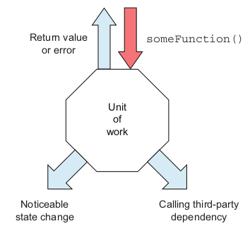

# [The Art of Unit Testing](https://book.douban.com/subject/34944396/)

## The basics of unit testing

Three types of exist points:

* return value。 这种最好做测试，只需要对返回值做断言
* state change。 比如一个class内部状态变化，可以调用getter方法观测到，也比较好测试
* call third-party dependency。 这种需要破除依赖才能测试。

关于dependency, 作者是这么定义的：

> A dependency is something we don't have full control over during a unit test. Or it can be something that trying to control in a test world make our lives miserable.

和[Unit Testing](https://book.douban.com/subject/34429421/)的定义比较，shared/out-of-process dependency 属于我们不能完全控制的，而 mutable private dependency 一部分属于这个 **something trying to control in a test world make our lives miserable** 。这句话其实很暧昧。对于作者属于哪个school也有点模糊，早期作者应该是London School，因为认为一个method是一个unit，现在有点倾向于 Classic School。他这个unit of work 范围很广，既可以包含一个method，也可以是多个component的组合。

关于 Integration Testing，作者是这么定义的:

> Integration testing is just unit testing with some or all of the dependencies being real and residing out of the current execution process.

这个就比较倾向于 Classic School 的界定了。

## A first unit test

这一章简单介绍了如何使用Jest，以及几个pattern。

* AAA pattern
* USE naming pattern (这种其实更适合偏技术的底层方法的命名)
* Factory method with test ( without any beforeEach ) ( 现在基本都倾向于独立小函数的复用方式了 )
