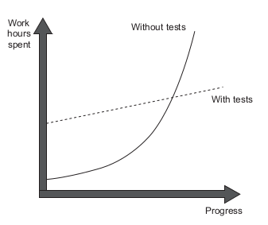
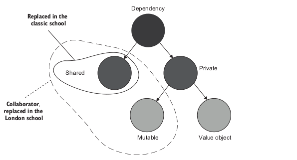

# [Unit Testing](https://book.douban.com/subject/34429421/)

这本书的主题是 how to write good unit tests

## The goal of unit testing

The goal is to enable **sustainable** growth of the software project.

单元测试的目标是赋能软件项目的持续发展。随着项目发展，为了改动很小的功能可能需要花费很大的工作量。



这种现象有个专有名词 **Software Entrophy** 软件熵 ， 还有个词 **deterioration** 代码腐化， 通俗的说法是祖传代码改不动了。

单元测试能减少代码腐化速度，一个表现是UT可以促进好的 code design , 因为可测试的代码一般是高内聚低耦合的。当然 代码的可测试性是代码质量的 negative indicator , 可测试的代码依然可以写的很烂。

为了实现UT的的目标，我们要写出好的单元测试来。

如何写出好的单元测试，增加UT数量吗？

> Not all tests are created equal

单纯的增加单元测试的数量并不能实现UT的目标，需要考虑测试的价值和成本。测试的成本包括了：

* 重构代码时所需要的对于测试的修改 (TODO Refactor不应该有很多UT更改， Restructure 才会 )
* UT运行时间
* 误报的处理
* 阅读理解成本

> Tests are code

> Code is a liability, not an asset

我们平时可能认为Test Code不像Production Code一样严肃，写得放飞自我，但是测试代码也是代码，写得放飞技术债迟早要还。

增加coverage能保证好的UT吗？

也不能。line coverage很容易虚高 （比如 assertion-free testing），branch coverage 相对合理一点，但是也不能保证 verify all the outcomes ( 《单元测试的艺术》中提到了三种outcome )

上面提到了 测试数量 和 覆盖率都是 good negative indicator 同时也是 bad positive indicator. 他们是好的UT的必要不充分条件。

那到底是什么好的单元测试呢，作者提出了这么几条guideline：

* It's integrated into the development cycle
* It targets only the most important parts of your code base ( domain model )
* It provides maximum value with minimum maintanance costs

## What is a unit test

A unit test is an automated test that :

* Verifies a small piece of code
* Does it quickly
* Does it in an isolated manner

Unit Test分为两个流派：


虽然作者说classic School更为经典，但是我似乎接触的更多的是London School。

London School认为Unit是指一个class，测试中要通过使用 **Test Double** 与其他类进行隔离。如果使用了真实的class在这个派别看来算是 integration test 了。

Classic School认为Unit是一个具体的功能，它可能包含一个或者多个class。要分离的是 Unit Tests 而不是Units，要破除的依赖是 Shared depencency 。



> A shared dependency is a dependency that is shared between tests and provides
means for those tests to affect each other’s outcome. A typical example of shared
dependencies is a static mutable field. A change to such a field is visible across all
unit tests running within the same process. A database is another typical example of
a shared dependency.

> A private dependency is a dependency that is not shared.

图中 **Value Object**指那些不可变的(所以还是FP好)

E2E tests are a subset of integration integration test.

E2E测试和integration测试区别更多在于用的真实dependency的多少。E2E显然更接近于生产的情况。

其实我觉得这一章有点太学院派了。我更倾向于 《The Art of Unit Testing》的观点，从单元测试到E2E测试是一个dependency的mock从多到少的过程，在这条连续谱带上会有 unit test、component test、integration test、e2e isolated test 、 e2e system test 。我们的测试应该是 layered ， connect low-level and high-level tests.

至于对于 mutable private dependency 的处理，一般也不会这么教条非要按照一个方式，要做trade-off, 工程是妥协的艺术。

## The anatomy of a unit test

这一章主要讲的是UT的Pattern

### Using the AAA pattern & Droopping the arrange act and assert comments from tests

Arrange Act和Assert构成一个单元测试。也有的地方称之为 Given-When-Then 。

有些人为了区分这三部分，喜欢写注释。结合本书和 《Java By Comparison》的观点，这三者分割应该用空行。

### Aoid multiple arrange, act and assert sections

这意味着在 verify multiple units of behaviour, 更像是 integration test 。

### Avoid if statements in tests

这意味着一次验证太多的东西，也意味着UT里面有太多的逻辑。

### Watch out for act section that are larger than a single line

如果act部分多余一行，这意味着封装程度不够，要多行act才能完成一个behavior

### How many assertions should the assert section hold

有些人认为一个UT case应该只有一个assertion，但是我们所测的是 a unit of hehavior 而不是 a unit of code, 一个behavior会产生多个outcome (参考 The art of Unit Testing) ， 我们在一个case里对多个outcome断言是很正常的。

### Resuing Test fixtures between tests

> A test fixture is an object the test runs against. This object can be a regular
dependency—an argument that is passed to the SUT. It can also be data in
the database or a file on the hard disk. Such an object needs to remain in a
known, fixed state before each test run, so it produces the same result.
Hence the word fixture.

本质上在UT中代码的复用，一种是 BeforeEach这种钩子方法 ， 一种是 封装独立的小函数。本书 《Java By Comparison》 《The Art of Unit Testing》都是倾向于 Standalone Tests 这种方法。这种方法一方面可以提高readability, 一方面可以更加灵活(因为独立的小函数可以传参)

### Naming Convention

UT的命名一个常见的做法是 ```MethodUnderTest_Senario_ExpectedResult``` ，在《The Art of Unit Testing》中表述为 USE pattern。作者倾向于 classic school，认为这种命名方式和实现太耦合，过渡描述实现的code而不是期望的behavior。

在low-level的测试，比如一些utility，这些和业务关联不强的可以用这种方式。稍微high-level的应该倾向于自然语言，比如说User Story的描述。
